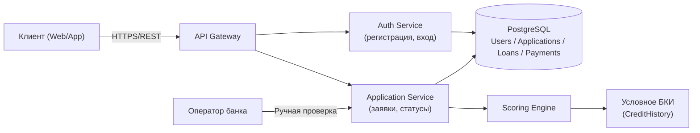
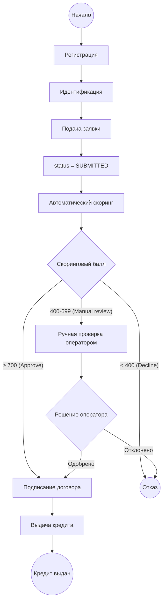
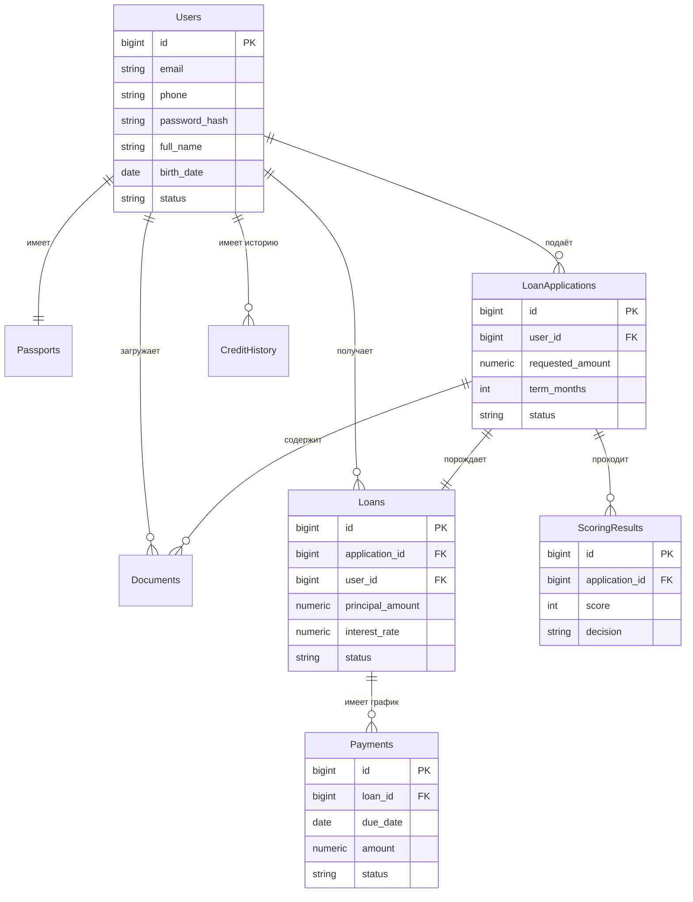

# 🏦 Bank Loan System — Онлайн-оформление потребительского кредита

> Учебный кейс уровня Junior/Middle IT Business/System Analyst: полный цикл документации и прототипирования системы онлайн-кредитования для цифрового банка — от бизнес-требований до REST API и аналитики данных.


---

## 📋 О проекте

**NovaBank** — условный цифровой банк, который хочет заменить визит в отделение полностью дистанционным оформлением потребительского кредита. Проект описывает бизнес-требования, функциональные и нефункциональные требования, UML/BPMN-диаграммы, схему базы данных, REST API и аналитику данных для такой системы.

Пользовательский путь:

**Регистрация → Идентификация → Подача заявки → Скоринг → (Ручная проверка) → Подписание договора → Выдача кредита → Просмотр статуса**

Полный аналитический пакет документов см. в [`/docs`](./docs).

---

## 🧰 Стек технологий (референсный, для реализации)

| Слой | Технология |
|---|---|
| Backend | Java/Spring Boot или Node.js/NestJS (описано на уровне API-контракта) |
| База данных | PostgreSQL 14+ |
| API | REST, OpenAPI 3.0 |
| Диаграммы | draw.io (BPMN/UML/ER), Mermaid |
| Аналитика | Python (pandas, matplotlib), Jupyter Notebook |
| Документация | Markdown |

---

## 🏗️ Архитектура (укрупнённо)



---

## 🔄 BPMN процесса оформления кредита

Полная версия — [`diagrams/BPMN.drawio`](./diagrams/BPMN.drawio) (открывается в [app.diagrams.net](https://app.diagrams.net)).



---

## 🗂️ Диаграмма классов данных (ER)

Полная версия — [`diagrams/ER.drawio`](./diagrams/ER.drawio).



---

## 🔌 REST API (кратко)

Полная спецификация — [`api/openapi.yaml`](./api/openapi.yaml), примеры запросов — [`api/examples.md`](./api/examples.md).

| Метод | Эндпоинт | Описание |
|---|---|---|
| POST | `/register` | Регистрация клиента |
| POST | `/login` | Аутентификация |
| POST | `/loan-application` | Подача заявки на кредит |
| GET | `/loan-application/{id}` | Статус заявки |
| POST | `/documents` | Загрузка документов |
| GET | `/loan/{id}` | Информация о кредите |
| GET | `/payments` | График/история платежей |

Пример ответа при направлении заявки на ручную проверку:

```json
{
  "id": 101,
  "status": "MANUAL_REVIEW",
  "scoring": { "score": 650, "decision": "MANUAL_REVIEW", "model_version": "v1.0" }
}
```

---

## 🗄️ База данных

Схема — [`database/schema.sql`](./database/schema.sql), тестовые данные — [`database/sample_data.sql`](./database/sample_data.sql), аналитические запросы — [`database/analytical_queries.sql`](./database/analytical_queries.sql).

**Таблицы:** `Users`, `Passports`, `LoanApplications`, `Loans`, `Payments`, `CreditHistory`, `ScoringResults`, `Documents`.

**Примеры аналитических запросов:**
- Количество выданных кредитов, средний размер кредита
- Процент отказов, среднее время рассмотрения заявки
- Клиенты с текущей просрочкой, топ-10 клиентов по объёму кредитов
- Кредиты по месяцам, средний возраст заёмщиков

---

## 📊 Аналитика данных

[`analytics/analysis.ipynb`](./analytics/analysis.ipynb) — разведочный анализ на синтетическом датасете [`analytics/loan_dataset.csv`](./analytics/loan_dataset.csv) (113 заявок, 120 клиентов): воронка статусов, распределение скорингового балла, анализ сумм/сроков кредитов, возрастной анализ заёмщиков, анализ просрочек.

---

## 📁 Структура репозитория

```
Bank-Loan-System/
│
├── README.md
│
├── docs/
│   ├── Business Requirements Document.md
│   ├── Functional Requirements.md
│   ├── Non Functional Requirements.md
│   ├── User Stories.md
│   ├── Use Cases.md
│   ├── Acceptance Criteria.md
│   └── Glossary.md
│
├── diagrams/
│   ├── BPMN.drawio
│   ├── UseCase.drawio
│   ├── Sequence.drawio
│   ├── Activity.drawio
│   └── ER.drawio
│
├── database/
│   ├── schema.sql
│   ├── sample_data.sql
│   └── analytical_queries.sql
│
├── api/
│   ├── openapi.yaml
│   └── examples.md
│
├── analytics/
│   ├── analysis.ipynb
│   └── loan_dataset.csv
│
└── images/
```

---

## 🚀 Как запустить проект

### База данных
```bash
createdb bank_loan_system
psql bank_loan_system -f database/schema.sql
psql bank_loan_system -f database/sample_data.sql
psql bank_loan_system -f database/analytical_queries.sql
```

### API (просмотр спецификации)
```bash
npx @redocly/cli preview-docs api/openapi.yaml
# или импортируйте api/openapi.yaml в Postman / Swagger UI
```

### Диаграммы
Откройте файлы `.drawio` из папки `diagrams/` на [app.diagrams.net](https://app.diagrams.net) (File → Open From → Device).

### Аналитика
```bash
cd analytics
pip install pandas matplotlib jupyter
jupyter notebook analysis.ipynb
```

---

## 🗺️ Roadmap

- [x] BRD, FR, NFR, User Stories, Use Cases, Acceptance Criteria
- [x] BPMN / UML Use Case / Sequence / Activity / ER диаграммы
- [x] Схема БД + тестовые данные + аналитические запросы
- [x] REST API + OpenAPI 3.0 + примеры запросов
- [x] Python-анализ данных (Jupyter Notebook)
- [ ] Интеграция с реальным БКИ (НБКИ/ОКБ)
- [ ] Квалифицированная электронная подпись договора
- [ ] Мобильное приложение (iOS/Android)
- [ ] Реструктуризация и досрочное погашение кредита

---

## 📄 Лицензия

MIT License — учебный проект, создан в образовательных целях.
